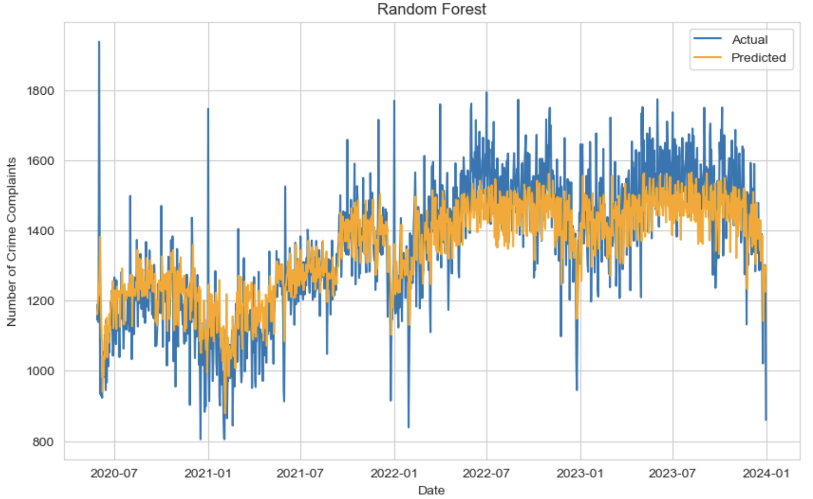

# Title
Author: [Scarlett Valentin](https://www.linkedin.com/in/scarlett-valentin/)

# Overview
The purpose of this project is to create a predictive **model to predict crime in New York City**. This model will assist the New York Police Department (NYPD) to combat crime by providing predictions of future daily crime incident reports. Utilizing this tool, the executive staff can determine a future plan for officers to prevent future crime or stop future crime as soon as possible. To create this model, I used a dataset from NYC Open Data of all valid felony, misdemeanor, and violation crimes reported to the NYPD from 2006 to the end of 2023. The final model is a **Random Forest Regressor** with an **RMSE of approximately 115** and **R2 score of approximately 0.64**.


# Business Understanding
New York City crime has gone through cycles. After the 2020 pandemic, many spoke about the increase in crime and the lack of enforcement against criminal behavior. The New York City Police Department (NYPD) is the largest and one of the oldest municipal police departments in the United States. The NYPD polices a city of approximately 8.5 million people. The purpose of this project is to **assist the NYPD keep crime levels low** through machine learning. I will do this **by creating a regressor model to predict daily reported crime incidents in New York City**. 

The stakeholders for this project include the New York City Police Commissioner and the Board of Commissioners. With an understanding of crime trends and future crime predictions, the executive staff can determine a future plan for officers to prevent future crime or intercept future crime as soon as possible.

In this project, I will complete the following 3 tasks:
1. **Analyze** crime trends in historical New York City crime data.
2. Create a random forest regressor model to **predict** daily reported crime incidents in New York city.
3. **Evaluate** the random forest regressor model and recommend next steps for the New York City Police Department.


# Data Understanding
The [data](https://data.cityofnewyork.us/Public-Safety/NYPD-Complaint-Data-Historic/qgea-i56i/about_data) has been extracted from NYC Open Data. It includes all valid felony, misdemeanor, and violation crimes reported to the New York City Police Department (NYPD) from 2006 to the end of 2023. There are 8,914,838 complaints reported. The data has 35 columns with reported information regarding each incident. The column descriptions can be found on the [data page](https://data.cityofnewyork.us/Public-Safety/NYPD-Complaint-Data-Historic/qgea-i56i/data_preview). 

After exploring the data, I resampled the data to include the number of reported crime incidents per day. I used this resampeld data, `data_daily`, to create the predictive model.


# Modeling


# Evaluation
**Metrics**:
- **RMSE**: RMSE of approximately 114 means that, on average, this model’s predictions are off by about 114 complaints per day. Since the mean daily complaints are 1352, the relative error is about 8.5% (114 / 1352 ≈ 0.08). In crime forecasting, an RMSE below 10% of the mean is generally considered good, depending on the data's variance.
- **R2**: This model is able to explain about 64% of the changes in crime complaints. This means it’s able to predict the number of complaints fairly well. The remaining 36% is due to other factors that we haven’t considered or are harder to predict, like random events or factors not included in our model. In short, 64% of the crime complaint pattern is understood by the model, and the rest is more unpredictable.

# Conclusion
Using a [dataset](https://data.cityofnewyork.us/Public-Safety/NYPD-Complaint-Data-Historic/qgea-i56i/about_data) of all valid felony, misdemeanor, and violation crimes reported to the NYPD from 2006 to the end of 2023 extracted from NYC Open Data, I have created a **Random Forest Regressor** model to predict crime in New York City. I analyzed different trends in the crime data as well as toyed with multiple model iterations. The final model has an RMSE of approximately 115 and R2 score of approximately 0.64. The various limitations and next steps for this project are listed below.

## Limitations
1. **Major changes in administrations** can have a great effect on future crime. This analysis and model does not account for that. Mayor Eric Adams has appointed a new New York City Police Commissioner in November 2024 (Jessica Tisch) and President Donald Trump has taken office in January 2025.
2. The date and time of the occurence of the crime is based on when it was reported to occur. Since the complaint may not be reported at the exact time of occurence, the **dates and times may not all be completely accurate**. This will have effects on accuracy of crime predictions.
3. Crime complaints which involve multiple offenses are classified according to the most serious offense. The less serious offenses are missing from the data as to only categorize it as one incident. This can also have effects on the accuracy of crime predictions.

## Next Steps
1. **Model Improvement**: To improve the model predictions, I will have to investigate additional features to include. I also will have to experiemnt with different models.
2. **Deployment**: The model must be deployed in order to be put to use. We will deploy it for the NYPD to access crime predictions in real time and for future data. User-friendly dashboards also shoudl be created to display these predictions and key insights.
3. **Long-Term Monitoring and Model Update**: The monitor must continue to be monitored regularly for performance degradation over time, especially as new data comes in. The model also must be retrained periodically to incorporate new data or changes in the patterns of complaints.

# For More Information
See the full analysis in the [Jupyter Notebook](/notebook.ipynb/) or review this [presentation](/presentation.pdf/). <br>
For questions, please feel free to contact me on [LinkedIn](https://www.linkedin.com/in/scarlett-valentin/).

# Repository Structure
```
├── images
├── README.md
├── notebook.ipynb
└── presentation.pdf
```
